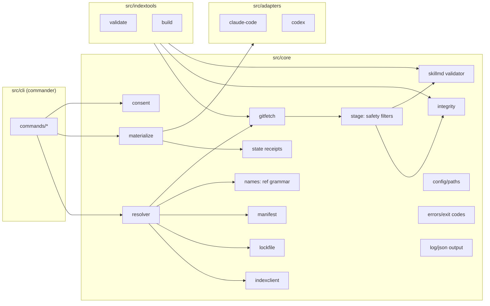

# skillet — Design Document (v1)

Status: Approved for issue planning (2026-07-07)
Owner: Saber5656
Canonical requirements source: this file + `docs/decisions/ADR-*.md`

skillet is a package manager for Agent Skills: search, install, version
management, and lockfile-based reproducibility for `SKILL.md` skill directories,
across multiple agent runtimes (Claude Code and Codex in v1).

Approved product decisions this design is built on (see ADR-001..ADR-006):

| Decision | Choice |
|---|---|
| Target runtimes | Multi-agent. Agent Skills open spec is canonical; runtime-specific install locations via adapters. v1 adapters: `claude-code`, `codex` |
| Distribution model | Central index repository (JSON metadata, curated via PRs) + skill payloads fetched from source git repositories. Direct git installs also supported |
| Implementation | TypeScript / Node.js >= 20, ESM. Distributed on npm |
| npm package | `@skillet/cli` (bin: `skillet`); fallback name `skillets` if the npm org cannot be registered |
| Publishing (skill authors) | Manual PR to the index repository, validated by CI. No `skillet publish` command in v1 |

---

## 1. Positioning

Existing tools (notably `npx skills` by vercel-labs) already do cross-agent skill
installation from git repos. None of them provide versioned releases, lockfiles,
reproducible installs, integrity verification, or a curated namespace
(see `docs/research/prior-art-and-naming.md`).

skillet's value proposition: **npm-grade rigor for skills**.

- Versioned releases (semver) resolved from a curated index
- `skillet.lock` for byte-reproducible team/CI installs
- sha256 content integrity, verified at install and on demand (`skillet verify`)
- Owner-bound package names (anti-typosquatting) enforced by index CI
- Explicit consent before anything lands on disk; skillet never executes skill code

## 2. Goals and non-goals

### v1 goals

1. Install skills into Claude Code and Codex, user scope and project scope.
2. Resolve semver ranges against a central index; pin exact commit + content hash.
3. `skillet.lock` reproducibility: `skillet install --frozen` in CI yields
   byte-identical skill trees or fails.
4. Search and inspect skills offline after an index fetch.
5. Direct git installs (`github:owner/repo/path#ref`, any git URL) and local-path
   installs for development.
6. Safe lifecycle: add, install, update (range-constrained), remove, list, verify.
7. Author-side validation (`skillet validate`) reusing the exact spec rules.
8. Index registry tooling (`skillet index validate|build`) so the index repo CI is
   a thin wrapper around the same code users run locally.
9. Security posture per section 12 (owner binding, integrity, no code execution,
   path-traversal/symlink defenses, consent UX).

### v1 non-goals (explicitly out)

- `skillet publish` automation (manual PR + CI instead; v2 candidate)
- Cryptographic signing of the index or packages (sigstore etc.; v2)
- Content/prompt-injection scanning of skill bodies (v2 research)
- Private index / authenticated registries (ambient git credentials do work for
  private *sources* since fetching shells out to `git`)
- Skill-to-skill dependencies
- Managing Claude Code plugins, `.claude/commands`, MCP servers, or agent configs
- Adapters beyond `claude-code` and `codex` (interface is designed for more)
- Telemetry of any kind
- Windows symlink strategies (materialization is copy-based everywhere)

## 3. Terminology

| Term | Meaning |
|---|---|
| Skill | A directory with a spec-conformant `SKILL.md` (agentskills.io) |
| Package | A skill tracked by skillet, identified as `owner/name` |
| Index | The curated registry: JSON metadata mapping packages/versions to git commits + integrity hashes |
| Source | Where payload bytes come from: a git repository (+ subpath) or a local path |
| Runtime / agent | A consumer of installed skills (`claude-code`, `codex`) |
| Adapter | Maps (runtime, scope) to an install base directory |
| Scope | `project` (default) or `user` (global, `-g`) |
| Manifest | `skillet.json` — declared dependencies (ranges) + target agents |
| Lockfile | `skillet.lock` — exact resolved versions/commits/integrity |
| State | `.skillet/state.json` — local receipts of what skillet materialized where |
| Materialize | Copy a verified skill tree into an adapter's skills directory |

## 4. Primary workflows

1. **Team project setup**: `skillet init` → `skillet add anthropics/pdf` →
   commit `skillet.json` + `skillet.lock` → teammates/CI run `skillet install --frozen`.
2. **Personal setup**: `skillet add -g saber5656/obsidian-canvas` installs into
   `~/.claude/skills/` and `~/.codex/skills/`.
3. **Discovery**: `skillet search pdf` → `skillet info anthropics/pdf` →
   `skillet add anthropics/pdf@^1`.
4. **Maintenance**: `skillet update` (within ranges) → review lock diff → commit.
   `skillet verify` in CI detects drift/tampering.
5. **Author**: develop with `skillet add file:../my-skill`; validate with
   `skillet validate ./my-skill`; release = git tag/commit + PR to index repo.

## 5. Architecture overview



Module layout (authoritative for issues):

```
src/
  cli/index.ts                 # entry: program, global flags, command registry
  cli/commands/{init,add,install,update,remove,list,search,info,verify,validate,cache,index}.ts
  core/config.ts               # paths, env overrides, user config file
  core/errors.ts               # SkilletError taxonomy + exit codes
  core/log.ts                  # human + --json output, TTY detection
  core/skillmd.ts              # SKILL.md frontmatter parse + spec validation
  core/names.ts                # package/source ref grammar (parse/format)
  core/schemas.ts              # zod models: manifest, lock, state, config, index
  core/manifest.ts             # skillet.json read/edit/write
  core/lockfile.ts             # skillet.lock read/write (stable serialization)
  core/indexclient.ts          # aggregate index fetch + ETag cache + queries
  core/resolver.ts             # range resolution, manifest/lock reconciliation
  core/gitfetch.ts             # mirror mgmt, fetch commit, enumerate/extract tree
  core/integrity.ts            # canonical tree hash (sha256)
  core/stage.ts                # staging dir + safety validation
  core/materialize.ts          # atomic copy/replace/remove in agent dirs
  core/state.ts                # state.json receipts
  core/consent.ts              # consent prompt, --yes / non-TTY rules
  core/spawn.ts                # minimal promisified child_process wrapper
  adapters/types.ts            # Adapter interface
  adapters/registry.ts         # id -> adapter, detection
  adapters/claude-code.ts
  adapters/codex.ts
  indextools/validate.ts       # index repo validation (used by index CI)
  indextools/build.ts          # aggregate index.json builder
schemas/                       # generated JSON Schemas (editor $schema support)
tests/                         # vitest: unit mirrors src/, helpers/, e2e/
```

Runtime dependencies (fixed set; adding one requires an ADR): `commander`, `zod`,
`yaml`, `semver`, `picocolors`. Node builtins otherwise (`node:child_process`,
global `fetch`). Dev: `typescript`, `tsup`, `vitest`, `eslint`, `prettier`.

## 6. Package identity and source references

### 6.1 Package identity

```
package-id   = owner "/" skill-name
owner        = GitHub owner (org or user) of the source repository, lowercased;
               1-39 chars, [a-z0-9-], no leading/trailing hyphen
skill-name   = Agent Skills spec name: 1-64 chars, [a-z0-9-], no leading/trailing
               hyphen, no consecutive hyphens
```

Rules:

- `owner` MUST equal the owner segment of the source repo URL (index CI enforces;
  anti-typosquat, see ADR-006).
- `skill-name` MUST equal the SKILL.md `name` and the skill directory basename.
- Materialized directory name is `skill-name` (runtimes require dir == name).
  Consequence: two packages with the same `skill-name` cannot coexist in one
  scope; the resolver rejects basename collisions (`E_NAME_CONFLICT`).

### 6.2 Dependency specifiers (manifest values)

| Form | Example | Resolution |
|---|---|---|
| Registry range | `"^1.2.0"`, `"~2.0"`, `"1.2.3"`, `"latest"` | Highest index version satisfying range (`latest` = highest stable) |
| Direct GitHub | `"github:acme/skills/tools/deploy#v2.1.0"` | `owner=acme`, repo `acme/skills`, path `tools/deploy`, ref `v2.1.0` (tag/branch/40-hex SHA). Lock pins the resolved SHA |
| Any git URL | `"git+https://gitlab.com/acme/skills.git#main"` with `path` via fragment `;path=tools/deploy` — NOT supported; instead use object form | see object form |
| Object form (git) | `{"git": "https://gitlab.com/acme/skills.git", "path": "tools/deploy", "ref": "v2.1.0"}` | Same as direct GitHub, host-agnostic |
| Local path | `"file:../my-skill"` | Copied from local dir; lock records `integrity` but marks entry `portable: false` and `install --frozen` fails if present |

Grammar notes: the `github:` shorthand is
`github:<owner>/<repo>[/<path...>]#<ref>` where `<ref>` is required (no floating
default-branch installs from the manifest; `skillet add` without `#ref` resolves
the current default-branch HEAD SHA at add time and writes the SHA-pinned form).

For direct-git packages, `package-id` is derived as `owner/<skill-name-from-SKILL.md>`
and version is the pseudo-version `0.0.0-git.<shortsha12>`.

## 7. Data models and file formats

All files are strict JSON, UTF-8, LF, two-space indent, trailing newline, keys
sorted (stable serialization is a lockfile requirement). All are validated with
zod schemas (`core/schemas.ts`); JSON Schema exports live in `schemas/`.

### 7.1 Manifest — `skillet.json` (project root) / `~/.skillet/skillet.json` (user scope)

```json
{
  "$schema": "https://raw.githubusercontent.com/Saber5656/skillet/main/schemas/skillet.schema.json",
  "agents": ["claude-code", "codex"],
  "skills": {
    "anthropics/pdf": "^1.2.0",
    "acme/deploy-helper": "github:acme/skills/tools/deploy-helper#9f8e7d6c5b4a3f2e1d0c9b8a7f6e5d4c3b2a1f0e",
    "acme/gitlab-skill": { "git": "https://gitlab.com/acme/skills.git", "path": "skills/gitlab-skill", "ref": "v2.1.0" },
    "local/dev-skill": "file:../dev-skill"
  }
}
```

| Field | Type | Rules |
|---|---|---|
| `agents` | string[] | Non-empty; each must be a known adapter id. Defines materialization targets for this scope |
| `skills` | map | Key = package-id (section 6.1); value = specifier (section 6.2) |

### 7.2 Lockfile — `skillet.lock` (sibling of its manifest)

```json
{
  "lockfileVersion": 1,
  "skills": {
    "anthropics/pdf": {
      "version": "1.2.0",
      "resolved": {
        "type": "index",
        "url": "https://github.com/anthropics/skills",
        "commit": "0123456789abcdef0123456789abcdef01234567",
        "path": "skills/pdf"
      },
      "integrity": "sha256-3fJ0...base64...=",
      "portable": true
    },
    "local/dev-skill": {
      "version": "0.0.0-local",
      "resolved": { "type": "path", "path": "../dev-skill" },
      "integrity": "sha256-....",
      "portable": false
    }
  }
}
```

`resolved.type` ∈ `index` | `git` | `path`. `commit` is always a 40-hex SHA for
`index`/`git`. `integrity` is `sha256-` + base64 of the canonical tree hash
(section 8) — for `index` entries it MUST equal the index-declared integrity.

### 7.3 State (receipts) — `<project>/.skillet/state.json` / `~/.skillet/state.json`

Local, never committed (`skillet init` appends `.skillet/` to `.gitignore`).

```json
{
  "stateVersion": 1,
  "installs": [
    {
      "package": "anthropics/pdf",
      "version": "1.2.0",
      "integrity": "sha256-...",
      "agent": "claude-code",
      "dir": ".claude/skills/pdf",
      "installedAt": "2026-07-07T00:00:00Z"
    }
  ]
}
```

`dir` is relative to the scope root (project root / `$HOME`). State answers:
what did skillet write, where, and with what hash — enabling safe removal,
drift detection, and `list`.

### 7.4 User config — `~/.skillet/config.json` (all fields optional)

```json
{
  "indexUrl": "https://raw.githubusercontent.com/Saber5656/skillet-index/main/index.json",
  "defaultAgents": ["claude-code"],
  "cacheDir": "~/.skillet/cache"
}
```

Environment overrides (highest precedence): `SKILLET_HOME` (replaces `~/.skillet`;
also the sandbox key for tests), `SKILLET_INDEX_URL`, `SKILLET_CACHE_DIR`,
`SKILLET_YES=1` (equivalent to `--yes`; intended for CI).

### 7.5 Index registry entry — `registry/<owner>/<skill-name>.json` (in the index repo)

```json
{
  "schemaVersion": 1,
  "name": "anthropics/pdf",
  "description": "Extract PDF text and tables, fill forms, merge files.",
  "keywords": ["pdf", "documents", "forms"],
  "source": { "type": "git", "url": "https://github.com/anthropics/skills" },
  "license": "MIT",
  "maintainers": [{ "github": "anthropics" }],
  "deprecated": null,
  "versions": [
    {
      "version": "1.2.0",
      "commit": "0123456789abcdef0123456789abcdef01234567",
      "path": "skills/pdf",
      "integrity": "sha256-...",
      "publishedAt": "2026-07-01T12:00:00Z"
    }
  ]
}
```

Rules (enforced by `skillet index validate`, see section 11):

- `source.url` MUST be `https://` (no ssh in the public index) and its owner
  segment MUST equal the `owner` of `name`.
- `versions[].version` valid semver, unique, and additions strictly increase.
- `versions[].path` is repo-relative, normalized, no `..`, no leading `/`.
- `deprecated`: `null` or `{ "reason": string, "replacement": package-id | null }`.

### 7.6 Aggregate index — `index.json` (built artifact, what clients fetch)

```json
{
  "indexSchemaVersion": 1,
  "generatedAt": "2026-07-07T00:00:00Z",
  "packages": [ /* array of 7.5 entries */ ]
}
```

Built by `skillet index build` in index-repo CI on merge to main; committed to the
index repo (served via `raw.githubusercontent.com`). Client caches it under
`<cacheDir>/index/` with the response `ETag` and revalidates with
`If-None-Match`; offline operation uses the cache with a staleness warning
(> 7 days). Scaling beyond a single file is a known unknown (section 15).

## 8. Canonical tree hash (integrity algorithm)

Deterministic across OSes and git hosts. Given a skill directory tree:

1. Enumerate all regular files recursively. Reject (hard error, `E_UNSAFE_TREE`):
   symlinks, submodules/gitlinks, any non-regular file type, any path segment
   equal to `.` or `..`, any path containing `\` or a NUL byte, and case-insensitive
   duplicate paths.
2. Limits (reject beyond): 1000 files, 20 MiB total content, 2 MiB single file,
   path length ≤ 512 bytes, depth ≤ 16.
3. For each file compute `sha256(content)` (raw bytes, no newline normalization).
4. Executability class: `x` if the git mode is `100755` (or, for local trees, the
   owner-execute bit is set); otherwise `f`.
5. Build the manifest string: for each file in bytewise-ascending order of its
   UTF-8 relative path (forward slashes):
   `<relpath> "\0" <class> "\0" <sha256-hex-lowercase> "\n"`
6. Integrity = `"sha256-" + base64(sha256(manifest-string-bytes))`.

The same algorithm runs (a) in index CI against the git tree at the pinned commit,
(b) in the client after extraction to stage, and (c) in `skillet verify` against
materialized directories. Test vectors are fixed in `tests/fixtures/integrity/`
(issue 14).

## 9. Resolution semantics

Inputs: manifest, lockfile (may be absent), index snapshot, CLI intent.

| Operation | Behavior |
|---|---|
| `add <ref>` | Parse ref → resolve to exact (version, commit, path, integrity) → stage+verify+consent → write manifest entry (range as given; default `^<resolved>` for registry adds without an explicit range) → update lock → materialize |
| `install` (lock present) | Install exactly what the lock says for every manifest entry; resolve only manifest entries missing from lock (then write lock) |
| `install --frozen` | Fail (`E_FROZEN_DRIFT`, exit 3) unless lock exists, every manifest entry has a lock entry satisfying its specifier, no orphan lock entries, and no `portable: false` entries. Never writes manifest/lock |
| `update [names...]` | Re-fetch index; re-resolve named (or all) registry entries to the highest version satisfying their manifest range; direct-git entries with branch refs re-resolve the branch head only when explicitly named; show old→new table; update lock; re-materialize changed |
| `remove <names...>` | Delete manifest + lock entries; unmaterialize from all agents (safety: section 10.3) |

Conflict rules evaluated at resolve time:

- `E_NAME_CONFLICT`: two manifest entries share a `skill-name` basename.
- `E_UNKNOWN_PACKAGE` / `E_NO_MATCHING_VERSION`: with remediation hints
  (nearest names by Levenshtein ≤ 2; available version list).
- Deprecated package: warning with reason/replacement; requires `--yes` or
  interactive confirm to proceed.

## 10. Install pipeline

### 10.1 State machine (per package operation)

```
RESOLVE → FETCH → EXTRACT → VERIFY → CONSENT → RECORD → MATERIALIZE → DONE
   |         |        |         |        |         |          |
   v         v        v         v        v         v          v
 E_RESOLVE E_FETCH  E_UNSAFE  E_INTEG  E_CONSENT (rollback  E_MATERIALIZE
                     _TREE    RITY     _DECLINED  manifest/  (rollback dir swap)
                                                  lock)
```

| Phase | Action | Failure handling |
|---|---|---|
| RESOLVE | section 9 | exit 3 |
| FETCH | ensure commit present in repo mirror (section 10.2) | network errors retried 2× with backoff; then exit 3 |
| EXTRACT | enumerate tree via `git ls-tree -r`, filter (section 8 step 1), write blobs to a fresh stage dir via `git cat-file --batch` | exit 4 |
| VERIFY | canonical hash == expected integrity; SKILL.md parses and satisfies spec; dir basename == name | exit 4 |
| CONSENT | section 12.4; skipped for already-consented identical (package, version, integrity) reinstalls | exit 5 |
| RECORD | write manifest + lock atomically (tmp file + rename) | restore previous files |
| MATERIALIZE | section 10.3 per (agent × scope) | best-effort rollback: restore previous dir if replacement fails midway; state.json updated last |

### 10.2 Git fetch strategy

- Mirror per source URL: `<cacheDir>/repos/<sha256(url)>/` created with
  `git init --bare` + `git remote add origin <url>`.
- Ensure commit: `git fetch origin <sha>` (works on GitHub/GitLab for advertised
  or reachable objects). Fallback chain if the host refuses SHA fetch:
  `git fetch origin +refs/heads/*:refs/heads/* +refs/tags/*:refs/tags/*` then
  verify `git cat-file -e <sha>^{commit}`; final failure → `E_FETCH`.
- Ref → SHA resolution (add-time, direct git): `git ls-remote origin <ref>` with
  standard tag/branch precedence (`refs/tags/x` over `refs/heads/x`); 40-hex refs
  used as-is.
- All git invocations use `core/spawn.ts` with: argument-vector execution (never
  a shell), scrubbed env (`GIT_TERMINAL_PROMPT=0`, `GIT_CONFIG_NOSYSTEM=1`,
  `-c protocol.ext.allow=never -c protocol.file.allow=never -c uploadpack.allowFilter` unset),
  60 s default timeout, stderr captured for error reporting. Only `https://`,
  `ssh://`/scp-style, and `file:` (tests only, behind env flag) transports allowed.

### 10.3 Materialization (per agent target)

Target dir: `<adapterBase(scope)>/skills/<skill-name>` (section 13 fixes bases).

- New install: copy stage → `<target>.skillet-tmp-<rand>` then `rename` to target.
- Replace: verify existing target is managed (state entry exists) AND its current
  hash equals the recorded integrity; if unmanaged or drifted → `E_TARGET_CONFLICT`
  (never overwrite silently; message tells the user to remove or rename it).
  Replacement: rename old → `<target>.skillet-old-<rand>`, rename new into place,
  delete old; on failure, rename old back.
- Remove: same managed+hash check; `--force` skips the hash check but never the
  "managed" check (skillet only ever deletes directories recorded in state).
- Executable bits from the extraction are preserved on POSIX; ignored on Windows.

## 11. Index registry design (separate repo: `skillet-index`)

Layout (bootstrap template is produced by issue 36 in `index-repo/` of this repo):

```
skillet-index/
  registry/<owner>/<skill-name>.json     # one file per package (section 7.5)
  index.json                             # built aggregate (section 7.6)
  CONTRIBUTING.md                        # how to submit a package/version
  .github/workflows/validate.yml         # PR: skillet index validate + build --check
  .github/workflows/build.yml            # main: skillet index build + commit
  .github/PULL_REQUEST_TEMPLATE.md
```

`skillet index validate <repo-dir>` checks, per changed entry:

1. JSON parses; zod schema valid; filename matches `name`.
2. Name/owner rules (section 6.1); owner == `source.url` owner (case-insensitive);
   no case-insensitive duplicate package names across the registry.
3. `source.url` is https, host in allowlist (`github.com`, `gitlab.com`,
   `codeberg.org`; extending = index-repo config change).
4. For each *added or changed* version: clone/fetch source, checkout `commit`,
   skill dir exists at `path`, SKILL.md valid per spec, SKILL.md `name` ==
   skill-name segment, dir basename == name, `metadata.version` (if present) ==
   `version`, recomputed integrity == declared `integrity`, tree passes safety
   filters and limits (section 8).
5. Semver validity; new versions strictly greater than existing; existing
   released versions immutable (changing `commit`/`integrity` of a published
   version is rejected — security invariant).
6. `description` 1-1024 chars; `keywords` ≤ 10, each ≤ 32 chars lowercase.

Curation model: maintainer-merged PRs. CI gives deterministic verdicts;
human review is the judgment layer (spam, impersonation, licensing red flags).

## 12. Security model

### 12.1 Trust boundaries

| Boundary | Trust level | Controls |
|---|---|---|
| skillet CLI itself (npm) | User-chosen | Minimal pinned deps; provenance publish; lockfile committed; release CI hardened (issue 40) |
| Index repo / aggregate over HTTPS | Curated, semi-trusted | HTTPS only; schema validation client-side; version immutability; signing deferred (v2, ADR-005) |
| Source git repos | Untrusted | SHA pinning; integrity hash must match index; tree safety filters; size limits; no code execution |
| Local FS (scopes, agent dirs) | User-owned | Managed-only writes/deletes via state receipts; atomic swaps; no writes outside scope bases + cache |
| Terminal/CI | User-owned | Consent prompt; `--yes`/`SKILLET_YES` explicit; non-TTY without consent → fail closed |

### 12.2 Threat table

| Threat | Mitigation |
|---|---|
| Typosquatting a popular skill | Owner-bound names (owner == repo owner, CI-enforced); Levenshtein hints on unknown names; curation |
| Tag/branch moved after listing | Index pins 40-hex commits; client refuses anything whose recomputed hash ≠ index integrity |
| Source repo compromised post-listing | Same as above — new malicious content cannot ship under an existing version; new versions go through PR review |
| Malicious payload: path traversal / symlink escape (zip-slip class) | Extraction enumerates `git ls-tree`; rejects symlinks (mode 120000), gitlinks (160000), `..`, absolute paths, `\`, NUL, case-fold duplicates — before any byte is written |
| Resource exhaustion (huge trees) | Hard limits: 1000 files / 20 MiB / 2 MiB per file / depth 16 |
| Skill contains malicious executable scripts | skillet never executes skill content (no hooks, by design — ADR-005); consent prompt lists script files and `allowed-tools`; runtimes apply their own sandboxing |
| Prompt injection inside SKILL.md body | Out of scope for v1 detection (honest limitation, documented in SECURITY.md); curation + consent transparency are the v1 controls |
| Malicious `git` URL → command/option injection | Arg-vector spawn only; URLs validated (scheme allowlist); refs validated (`^[A-Za-z0-9._/-]{1,255}$`, no leading `-`); `--` separators on all git pathspec boundaries |
| Lockfile tampering in a team repo | Same trust class as `package-lock.json`: review diffs; `verify` detects divergence between lock and materialized content |
| MITM on index fetch | HTTPS with default CA trust; URL not overridable by project files (only user config/env — a hostile repo cannot silently repoint the index) |
| skillet supply chain | 5 runtime deps, exact-pinned via committed `package-lock.json`; `npm publish --provenance` from GitHub Actions OIDC; actions pinned to SHAs; Dependabot + CodeQL (issue 40) |

### 12.3 Secure defaults

- Fail closed everywhere; `--force` never bypasses "managed-only deletion".
- No network besides: index URL (GET) and `git` to declared source URLs.
- No execution of fetched content; no install hooks; ever.
- Project files can never change the index URL or auto-approve consent.

### 12.4 Consent UX

First install (or changed integrity) of a package prints, before touching
manifest/lock/targets:

```
anthropics/pdf@1.2.0  (index: github.com/anthropics/skills @ 0123456)
  files: 14 (312 KiB)   scripts: 2 executable (scripts/extract.py, scripts/merge.sh)
  allowed-tools: Bash(python:*) Read
  license: MIT
Install to: claude-code (project), codex (project)? [y/N]
```

Non-TTY without `--yes`/`SKILLET_YES=1` → `E_CONSENT_DECLINED` (exit 5).

## 13. Agent adapters

```ts
export interface Adapter {
  id: "claude-code" | "codex" | string;
  displayName: string;
  detect(env: PlatformEnv): Promise<boolean>;      // user-scope presence heuristic
  baseDir(scope: "user" | "project", roots: ScopeRoots): string;
  // v1 both adapters: <base>/skills/<skill-name>
}
```

| Adapter | user base | project base | detect() |
|---|---|---|---|
| `claude-code` | `~/.claude` | `<project>/.claude` | `~/.claude` exists |
| `codex` | `~/.codex` | `<project>/.codex` | `~/.codex` exists |

Skills land in `<base>/skills/<skill-name>/`. Adapter selection order:
`--agents` flag > manifest `agents` > user config `defaultAgents` > detected set;
empty result → `E_NO_AGENTS` with setup guidance. Unknown adapter id anywhere →
`E_UNKNOWN_AGENT` listing known ids.

## 14. CLI specification

Global: `skillet [command] [flags]`. Global flags: `--json` (NDJSON-free single
JSON document on stdout; all human text to stderr), `--yes/-y`, `--verbose`,
`--no-color` (also `NO_COLOR`), `-C <dir>` (chdir before running),
`--scope project|user` (default project; `-g` = `--scope user`), `--agents <ids…>`.

Exit codes (fixed contract, `core/errors.ts`):

| Code | Meaning |
|---|---|
| 0 | Success |
| 1 | Unexpected/internal error |
| 2 | Usage error (bad args/flags/ref grammar) |
| 3 | Resolution/fetch failure (incl. `--frozen` drift, offline without cache) |
| 4 | Integrity or safety verification failure |
| 5 | Consent declined / required but unavailable |
| 6 | Verify found drift (missing/modified) |

Commands (authoritative behavior in sections 9-10; per-command details in issues):

| Command | Synopsis | Notes |
|---|---|---|
| `init` | `skillet init [--agents ids…] [-g]` | Creates manifest (detected agents), appends `.skillet/` to `.gitignore` (project scope) |
| `search` | `skillet search <query> [--keyword k]…` | Substring+prefix ranking over name/description/keywords; table or `--json` |
| `info` | `skillet info <package-id>[@range]` | Metadata, versions, deprecation, source |
| `add` | `skillet add <ref…>` | Section 9; multiple refs allowed |
| `install` | `skillet install [--frozen]` | Section 9 |
| `update` | `skillet update [names…]` | Section 9; prints old→new table |
| `remove` | `skillet remove <names…>` | Section 9/10.3 |
| `list` | `skillet list [--all-scopes]` | Lock/state/agents join; drift flags |
| `verify` | `skillet verify` | Rehash materialized vs lock+state; exit 6 on drift |
| `validate` | `skillet validate [path]` | Author tool: spec + safety + limits on a local skill dir |
| `cache` | `skillet cache dir|clean` | Cache path / wipe cache (never touches installs) |
| `index` | `skillet index validate|build [dir] [--check]` | Index-repo tooling (section 11) |

`--json` output envelope: `{ "ok": boolean, "command": string, "data": …,
"error": { "code": "E_…", "message": string } | null }`.

## 15. v2 deferred and known unknowns

Deferred (v2+): `skillet publish` (PR automation), index/package signing
(sigstore), advisory/yank flow beyond `deprecated`, flat-name aliases,
prompt-injection heuristics, more adapters (Cursor, OpenCode, Copilot, Gemini
CLI), sharded/CDN index, parallel fetch, `skillet new` scaffolding, private
indexes, popularity/download stats.

Known unknowns (may spawn issues during implementation):

| Unknown | Contingency |
|---|---|
| npm org `skillet` availability (user manual action) | Fallback package name `skillets`; single-string change in issue 01 |
| Arbitrary-SHA fetch support differences across git hosts | Fallback chain in 10.2; worst case full fetch of refs |
| Aggregate index growth | Split/shard + Pages/CDN in v2; schema carries `indexSchemaVersion` |
| `skills-ref` parity for spec validation | Conformance test comparing our validator against skills-ref test corpus |
| Case-insensitive filesystems vs owner casing | Owners lowercased everywhere (6.1); covered by unit tests |
| Codex behavior with extra non-skill files in `skills/` dirs | Adapters only write skill dirs; no shared files |

## 16. Testing strategy (summary; full plan in ISSUE_PLAN)

- Unit tests per module (vitest), no network: git fixtures built locally
  (`tests/helpers/gitfixture.ts`), index served from local HTTP fixture.
- Sandbox: every test sets `SKILLET_HOME`/`HOME` to a temp dir; CLI e2e runs the
  built binary via `node dist/cli.js` with scrubbed env.
- Security suite (issue 37): malicious fixture repos (symlinks, traversal names,
  oversize, case-fold dupes, executable floods) asserting `E_UNSAFE_TREE`/limits.
- Cross-platform CI matrix: ubuntu-latest, macos-latest, windows-latest × Node 20/22.
- Determinism tests: lockfile serialization byte-stable; integrity test vectors.
